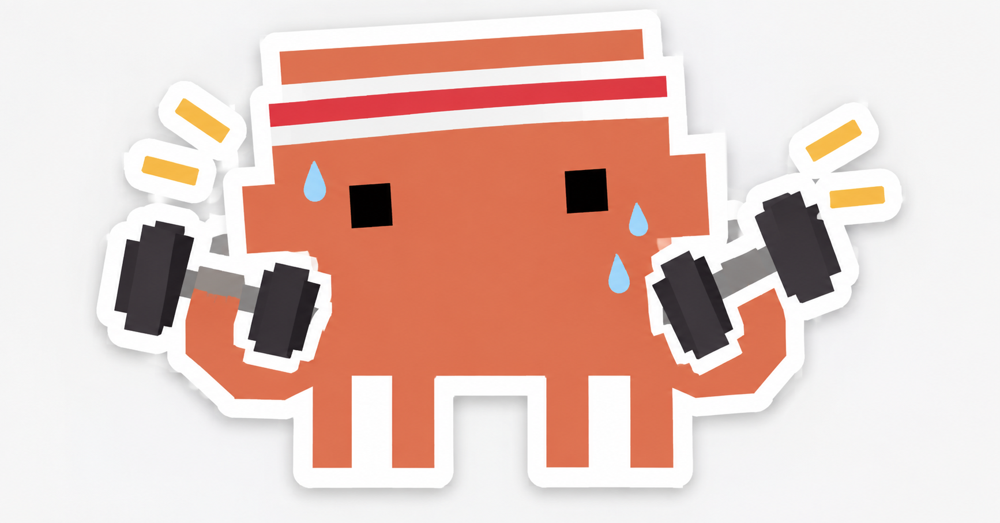

<div align="center">



# calicoach

**Trasforma Claude Code in un coach esperto di calisthenics e forza** — che ti
fa l'intervista iniziale, ti sottopone a uno screening per il rischio infortuni,
ti scrive la scheda in Markdown e ti segue mentre la svolgi.

[](LICENSE)
[](https://nodejs.org)
[](https://docs.claude.com/en/docs/claude-code/overview)
[](#le-skill)

[🇬🇧 Read in English](README.md) · 🇮🇹 Italiano

</div>

---

## Avvio rapido

```
/plugin marketplace add Fasertio/calicoach
/plugin install calicoach@calicoach
/calicoach:init
```

Poi lancia `/calicoach:onboard` e il coach ti intervista.

Preferisci il terminale, o usi un altro agente? La CLI installa tutto nel
progetto corrente:

```bash
npx github:Fasertio/calicoach
```

> [!NOTE]
> Il pacchetto non è ancora pubblicato sul registry npm. Una volta pubblicato,
> `npx calicoach` sarà la forma breve del comando qui sopra.

## Indice

- [Cosa fa](#cosa-fa)
- [Installazione](#installazione)
- [Le skill](#le-skill)
- [I comandi](#i-comandi)
- [Il tuo workspace](#il-tuo-workspace)
- [Principi di progettazione](#principi-di-progettazione)
- [Ambito e sicurezza](#ambito-e-sicurezza)
- [Costo in contesto](#costo-in-contesto)
- [Sviluppo](#sviluppo)
- [Licenza](#licenza)

---

## Cosa fa

| | |
|---|---|
| **Intervista** | un colloquio strutturato — obiettivi, storia di allenamento, infortuni, disponibilità settimanale, attrezzatura, stile di vita — scritto in `calicoach/athlete/profile.md` |
| **Screening** | uno screening del movimento auto-somministrato che produce controindicazioni vincolanti, che la programmazione deve rispettare |
| **Test** | una baseline misurata, così le progressioni partono da numeri reali e non da stime |
| **Programma** | un blocco di allenamento completo (la *scheda*) in Markdown: struttura settimanale, serie, ripetizioni, tempo, recuperi, regole di progressione *e* di regressione, autoregolazione, deload e date di revisione |
| **Dettaglia** | ogni esercizio prescritto arriva come scheda completa — setup, esecuzione fase per fase, cue, respirazione, errori comuni, note di rischio, regressioni, progressioni e riferimenti |
| **Integra i pesi** | bilanciere, manubri, cavi e macchine dove battono l'alternativa a corpo libero, o dove un vincolo l'ha esclusa |
| **Protegge** | preparazione articolare, prehab, protocolli di carico tendineo, guardrail sul carico e un semaforo del dolore scritto in ogni scheda |
| **Ti segue** | log delle sedute, check di readiness, aggiustamenti al volo, revisioni di fine blocco |
| **Impara dalle tue fonti** | dagli un libro, un PDF o gli appunti del tuo coach, e programma a partire da quelli |

Tutto viene scritto su disco. Il tuo storico di allenamento è fatto di file
Markdown che possiedi, non di una chat che scorre via.

---

## Installazione

### Come plugin di Claude Code (consigliato)

```
/plugin marketplace add Fasertio/calicoach
/plugin install calicoach@calicoach
/calicoach:init
```

Il plugin porta le 14 skill e i 13 comandi `/calicoach:*`. `/calicoach:init`
crea il workspace dell'atleta nel progetto corrente.

### Da terminale

```bash
# a livello di progetto — installa skill e comandi in ./.claude
# e crea ./calicoach
npx github:Fasertio/calicoach

# a livello utente — disponibile in ogni progetto
npx github:Fasertio/calicoach --global
```

<details>
<summary><b>Tutti i comandi della CLI</b></summary>

| Comando | Cosa fa |
|---|---|
| `init` | installa skill e comandi e crea il workspace (default) |
| `skills` | installa solo skill e comandi, senza workspace |
| `workspace` | crea solo il workspace, senza skill |
| `check [file]` | valida il workspace — vedi sotto |
| `status` | a che punto sei nel ciclo di coaching e cosa è in scadenza (sola lettura) |
| `list` | mostra cosa è incluso: skill e comandi |
| `doctor` | valida il pacchetto e riporta lo stato dell'installazione |
| `uninstall` | rimuove skill e comandi; lascia intatta `calicoach/` |

`check` verifica la scheda consegnata — budget di volume, rapporto push:pull,
bilanciamento strutturale sui sei assi, schede esercizio mancanti, trigger di
progressione, durata delle sedute, date e chiavi di citazione, e ogni esercizio
contro i vincoli attivi — più il profilo, lo screening e la baseline, segnalando
se uno di questi è ormai obsoleto.

</details>

<details>
<summary><b>Tutte le opzioni</b></summary>

| Opzione | Effetto |
|---|---|
| `-g, --global` | installa in `~/.claude/skills` |
| `--dir <path>` | cartella di destinazione (default: cartella corrente) |
| `-f, --force` | sovrascrive i file delle skill già presenti (non tocca mai i tuoi dati di atleta) |
| `--only <ids>` | id delle skill separati da virgola |
| `--agent <id>` | `init`: `claude` (default), `codex`, `cursor`, `generic` |
| `--strict` | `check`: tratta i warning come errori |
| `--json` | `status`: emette JSON invece della tabella |
| `--no-banner` | output più silenzioso |
| `-h, --help` · `-v, --version` | aiuto, versione |

</details>

### Altri agenti (Codex, Cursor, qualsiasi cosa legga `AGENTS.md`)

```bash
npx github:Fasertio/calicoach init --agent generic
```

Scrive le skill in `.agent/skills/` e genera un `AGENTS.md` che le indicizza. Gli
slash command esistono solo in Claude Code; `AGENTS.md` descrive a parole gli
equivalenti.

---

## Le skill

| Skill | A cosa serve |
|---|---|
| `calisthenics-coach` | il punto di ingresso — dottrina, contratto sul workspace, routing |
| `athlete-onboarding` | il colloquio iniziale e il profilo dell'atleta |
| `movement-screening` | lo screening del movimento, il triage delle red flag, le controindicazioni |
| `assessment-testing` | baseline misurate e ritest |
| `program-design` | scrivere e rivedere il blocco di allenamento |
| `exercise-library` | il formato obbligatorio della scheda esercizio e il catalogo dei movimenti |
| `skill-progressions` | planche, lever, verticale, muscle-up, human flag, pistol, trazione a un braccio |
| `weight-room-integration` | bilanciere, manubri, cavi e macchine |
| `injury-prevention` | riscaldamento, prehab, carico tendineo, guardrail sul carico |
| `session-logging` | check di readiness, log delle sedute, aggiustamenti al volo |
| `progress-review` | analisi di fine blocco e brief per il blocco successivo |
| `knowledge-ingestion` | i tuoi libri, PDF e appunti del coach |
| `anatomy-and-biomechanics` | perché un esercizio funziona e perché una posizione è rischiosa |
| `recovery-and-nutrition` | sonno, alimentazione, stress — con ambito limitato e regole di rinvio allo specialista |

---

## I comandi

Digita `/calicoach:` in Claude Code per vederli tutti.

| Comando | Cosa fa |
|---|---|
| `/calicoach:init` | crea il workspace in questo progetto |
| `/calicoach:status` | a che punto sei nel ciclo e cosa è in scadenza |
| `/calicoach:onboard` | il colloquio iniziale e il tuo profilo |
| `/calicoach:screen` | lo screening del movimento e i tuoi vincoli vincolanti |
| `/calicoach:test` | misura una baseline |
| `/calicoach:program` | scrive o rivede il blocco |
| `/calicoach:log` | registra una seduta, o adatta quella di oggi |
| `/calicoach:review` | revisione di fine blocco e brief successivo |
| `/calicoach:pain` | qualcosa fa male — triage e adattamento |
| `/calicoach:skill` | planche, lever, muscle-up, verticale, human flag |
| `/calicoach:exercise` | la scheda completa di un singolo esercizio |
| `/calicoach:learn` | aggiunge un libro, un PDF o un metodo come fonte |
| `/calicoach:check` | valida la scheda e ciò da cui è stata costruita |

Ogni comando è un router: stabilisce a che punto sei con una sola chiamata a
`calicoach status`, poi passa il lavoro alla skill che lo sa fare. La dottrina
vive nelle skill, una volta sola — un comando porta l'intenzione, mai le regole.

---

## Il tuo workspace

```
calicoach/
  athlete/
    profile.md        chi sei, obiettivi, storia, vincoli, attrezzatura
    screening.md      esiti dello screening e limiti vincolanti sulla programmazione
    baseline.md       risultati dei test misurati
  programs/
    2026-09-06_block-1_foundation.md
  logs/
    2026-09-08_w1d1.md
  reviews/
    2026-10-04_block-1-review.md
  references/
    INDEX.md          i tuoi libri, PDF e appunti del coach
```

Claude li legge all'inizio di ogni turno di coaching. Sono loro la fonte di
verità, non la conversazione.

---

## Principi di progettazione

**Evitare l'infortunio conta più dello stimolo.** Il tessuto connettivo si adatta
in mesi, il muscolo in settimane. Tetti di volume a braccia tese, limiti alla
velocità di avanzamento delle leve, rotazione delle prese, prehab obbligatorio e
un semaforo del dolore messo nero su bianco servono a una cosa sola: una scheda
che sopravvive al contatto con l'atleta.

**Nessuna scheda senza profilo; nessun carico senza screening.** Il coach si
rifiuta di tirare a indovinare su obiettivi, infortuni o attrezzatura. Se insisti,
ti dà una settimana provvisoria deliberatamente sottomassimale, e te lo dice.

**Il documento è verificato dalla macchina.** `calicoach check` verifica ciò che
un parser può verificare: che il budget di volume corrisponda alle serie
effettivamente scritte, che il volume di tirata sia almeno pari a quello di
spinta, che ogni esercizio abbia la sua scheda e sia un trigger di progressione
sia uno di regressione, che ogni seduta stia nella durata dichiarata, e che date
e chiavi di citazione siano complete. Una scheda non è finita finché non passa.

**Un vincolo è applicato, non solo dichiarato.** Ogni controindicazione dichiara
cosa vieta in un vocabolario controllato di qualità del movimento, così il
checker la confronta con ogni esercizio di ogni seduta. Uno screening che dice
"niente spinte sopra la testa" e una scheda che ne contiene una di nascosto sono
un errore intercettato, non una questione di rileggere con più attenzione. Lo
stesso controllo copre profilo, screening e baseline, e ti avvisa quando uno dei
tre è invecchiato sotto la scheda che ci è stata costruita sopra.

Niente di tutto questo può giudicare se il coaching sia *buono* — solo che non
sia incoerente.

**Ogni esercizio arriva completo.** Un nudo "3x8 trazioni" non è mai un output
accettabile. Ti alleni da solo; la scheda è il coach che ti sta accanto.

**Niente viene inventato.** I riferimenti sono libri e organizzazioni con nome e
cognome, più termini di ricerca video — mai URL, numeri di pagina o studi
inventati. Una fonte che il coach non ha letto viene etichettata come non letta,
e da lì non si programma.

**Sulle tue fonti comandi tu.** Porta un libro o il metodo di un coach e quello
ha la precedenza su ordine delle progressioni, scelta degli esercizi e stile. Non
scavalca mai una controindicazione dello screening o un guardrail sul carico — e
quando c'è conflitto ti vengono mostrate entrambe le posizioni e decidi tu.

---

## Ambito e sicurezza

> [!WARNING]
> calicoach è un assistente di coaching. **Non** è un dispositivo medico, una
> diagnosi, un piano fisioterapico, né un'idoneità al rientro sportivo dopo un
> infortunio.

Fa il triage delle red flag — dolore dopo un trauma, dolore notturno,
intorpidimento, perdita di forza improvvisa, un'articolazione che cede, dolore
toracico, sintomi sistemici — e ti dice di rivolgerti a un clinico, in modo
diretto e senza allarmismi, continuando a seguirti su tutto ciò che è
inequivocabilmente sicuro. Gravidanza, patologie cardiovascolari, respiratorie o
metaboliche, interventi chirurgici recenti, osteoporosi e una storia di disturbi
alimentari richiedono prima il via libera medico.

Allenati con la testa. Fai controllare l'ancoraggio prima di appenderti.

---

## Costo in contesto

Avere calicoach installato costa circa **1.100 token** — le quattordici
descrizioni delle skill. Tutto il resto si carica solo quando viene usata la
skill che lo richiama. I tredici comandi non aggiungono nulla di residente, e
ognuno apre il proprio turno con un preflight `calicoach status` — circa 40
token, là dove leggere profilo, screening, baseline e scheda ne costerebbe circa
3.000.

Vedi [docs/context-budget.md](docs/context-budget.md) per l'impronta completa, il
costo del turno più pesante e la regola che ogni nuova skill deve rispettare;
rigenera i numeri con `npm run budget`.

---

## Sviluppo

Requisiti: **Node.js 18+**. Nessuna dipendenza a runtime.

```bash
git clone https://github.com/Fasertio/calicoach.git
cd calicoach

npm test            # 111 test su node:test — niente da installare
npm run doctor      # valida il pacchetto e riporta lo stato dell'installazione
npm run budget      # rigenera i numeri del context budget
```

Struttura del repository:

| Percorso | Cosa contiene |
|---|---|
| `skills/` | le 14 skill — ciascuna un `SKILL.md` più i suoi `references/` |
| `commands/` | i 13 router dei comandi `/calicoach:*` |
| `templates/` | i file che vengono creati in un nuovo workspace |
| `src/`, `bin/` | la CLI — install, export, check, status |
| `test/` | la suite di test |
| `docs/` | context budget, specifiche e piani |
| `examples/` | una scheda reale consegnata, usata per calibrare il formato di output |

Issue e pull request sono benvenute. Se modifichi una skill, lancia prima
`npm test` e `npm run budget` — i test validano il frontmatter delle skill e i
link interni, e il budget è un contratto dichiarato.

---

## Licenza

[GPL-3.0-or-later](LICENSE).
