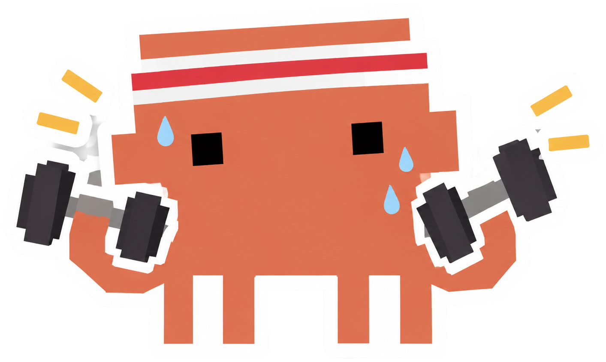

<div align="center">



# calicoach

**Turn Claude Code into an expert calisthenics and strength coach** — one that
onboards you, screens you for injury risk, writes your program in Markdown, and
follows you through it.

[](LICENSE)
[](https://nodejs.org)
[](https://docs.claude.com/en/docs/claude-code/overview)
[](#the-skills)

🇬🇧 English · [🇮🇹 Leggi in italiano](README.it.md)

</div>

---

## Quick start

```
/plugin marketplace add Fasertio/calicoach
/plugin install calicoach@calicoach
/calicoach:init
```

Then run `/calicoach:onboard` and the coach interviews you.

Prefer the terminal, or another agent? The CLI installs everything into the
current project:

```bash
npx github:Fasertio/calicoach
```

> [!NOTE]
> The package is not on the npm registry yet. Once it is published,
> `npx calicoach` will be the shorter equivalent of the command above.

## Contents

- [What it does](#what-it-does)
- [Install](#install)
- [The skills](#the-skills)
- [The commands](#the-commands)
- [Your workspace](#your-workspace)
- [Design principles](#design-principles)
- [Scope and safety](#scope-and-safety)
- [Context cost](#context-cost)
- [Development](#development)
- [Roadmap](docs/roadmap.md)
- [Licence](#licence)

---

## What it does

| | |
|---|---|
| **Onboards** | a structured intake interview — goals, training history, injuries, schedule, equipment, lifestyle — written to `calicoach/athlete/profile.md` |
| **Screens** | a self-administered movement screen that produces hard contraindications the programming must respect |
| **Tests** | a measured baseline, so progressions start from real numbers instead of guesses |
| **Programs** | a full training block (the *scheda*) in Markdown: weekly structure, sets, reps, tempo, rest, progression *and* regression rules, autoregulation, deload and review dates |
| **Details** | every prescribed exercise ships as a full card — setup, phase-by-phase execution, cues, breathing, common faults, risk notes, regressions, progressions, and references |
| **Integrates weights** | barbell, dumbbell, cable and machine work where they beat the bodyweight option, or where a constraint removed one |
| **Protects** | joint prep, prehab, tendon-loading protocols, load guardrails, and a pain traffic-light written into every program |
| **Follows up** | session logs, readiness checks, on-the-fly adjustment, block reviews |
| **Learns your sources** | give it a book, a PDF, or your coach's notes, and it programs from them |

Everything is written to disk. Your training record is Markdown files you own,
not a chat transcript that scrolls away.

---

## Install

### As a Claude Code plugin (recommended)

```
/plugin marketplace add Fasertio/calicoach
/plugin install calicoach@calicoach
/calicoach:init
```

The plugin brings the 15 skills and the 13 `/calicoach:*` commands.
`/calicoach:init` scaffolds the athlete workspace in the current project.

### From the terminal

```bash
# project scope — installs the skills and commands into ./.claude
# and scaffolds ./calicoach
npx github:Fasertio/calicoach

# user scope — available in every project
npx github:Fasertio/calicoach --global
```

<details>
<summary><b>All CLI commands</b></summary>

| Command | What it does |
|---|---|
| `init` | install the skills and commands, and scaffold the workspace (default) |
| `skills` | install the skills and commands only, no workspace |
| `workspace` | create the workspace only, no skills |
| `check [files]` | validate the workspace — see below |
| `status` | where you are in the coaching loop, and what is due next (read-only) |
| `cards` | every exercise card you already have, and where it lives |
| `budget` | what the framework costs in context, per skill and per coaching turn |
| `list` | show what is bundled: skills and commands |
| `doctor` | validate the package and report the install status |
| `uninstall` | remove the skills and the commands; leaves `calicoach/` alone |

`check` verifies the delivered program — volume budget, push:pull ratio, six-axis
structural balance, missing cards, progression triggers, session time, dates and
citation keys, and every exercise against the active constraints — plus the
profile, the screen and the baseline, including whether any of them has gone
stale.

</details>

<details>
<summary><b>All options</b></summary>

| Option | Effect |
|---|---|
| `-g, --global` | install into `~/.claude/skills` |
| `--dir <path>` | target directory (default: cwd) |
| `-f, --force` | overwrite existing skill files (never touches your athlete data) |
| `--only <ids>` | comma-separated skill ids |
| `--agent <id>` | `init`: `claude` (default), `codex`, `cursor`, `generic` |
| `--strict` | `check`: treat warnings as errors |
| `--json` | `status`: emit JSON instead of the table |
| `--no-banner` | quieter output |
| `-h, --help` · `-v, --version` | help, version |

</details>

### Other agents (Codex, Cursor, anything that reads `AGENTS.md`)

```bash
npx github:Fasertio/calicoach init --agent generic
```

This writes the skills to `.agent/skills/` and generates an `AGENTS.md` indexing
them. Slash commands are Claude Code only; `AGENTS.md` describes the equivalents
in prose.

---

## The skills

| Skill | Use it for |
|---|---|
| `calisthenics-coach` | the entry point — doctrine, workspace contract, routing |
| `athlete-onboarding` | the intake interview and the athlete profile |
| `movement-screening` | the movement screen, red-flag triage, contraindications |
| `assessment-testing` | measured baselines and retests |
| `program-design` | writing and revising the training block |
| `exercise-library` | the mandatory exercise-card format and the movement catalogue |
| `skill-progressions` | planche, levers, handstand, muscle-up, flag, pistol, one-arm pull-up |
| `weight-room-integration` | barbell, dumbbell, cable and machine work |
| `injury-prevention` | warm-ups, prehab, tendon loading, load guardrails |
| `session-logging` | readiness checks, session logs, on-the-fly adjustment |
| `progress-review` | end-of-block analysis and the next-block brief |
| `knowledge-ingestion` | your books, PDFs and coach's notes |
| `anatomy-and-biomechanics` | why an exercise works and why a position is risky |
| `conditioning-and-endurance` | work capacity, intervals, circuits, and what cardio costs your lifts |
| `recovery-and-nutrition` | sleep, food, stress — scope-limited, with referral rules |

---

## The commands

Type `/calicoach:` in Claude Code to see them all.

| Command | What it does |
|---|---|
| `/calicoach:init` | Set up the calicoach workspace in this project |
| `/calicoach:status` | Where you are in the coaching loop and what is due next |
| `/calicoach:onboard` | Interview you and write your athlete profile |
| `/calicoach:screen` | Run the movement screen and record your hard constraints |
| `/calicoach:test` | Measure a baseline your programming can start from |
| `/calicoach:program` | Write or revise your training block |
| `/calicoach:log` | Record a session, or adjust today's before you train |
| `/calicoach:review` | Review the block and brief the next one |
| `/calicoach:pain` | Something hurts — triage it and adjust the load |
| `/calicoach:skill` | Program a skill: planche, lever, muscle-up, handstand, flag |
| `/calicoach:exercise` | Show the full card for one exercise |
| `/calicoach:learn` | Add a book, PDF or method as a source |
| `/calicoach:check` | Validate your program and the documents it was built from |
Each command is a router: it establishes where you stand with one call to
`calicoach status`, then hands off to the skill that does the work. The doctrine
lives in the skills, once — a command carries intent, never rules.

---

## Your workspace

```
calicoach/
  athlete/
    profile.md        who you are, goals, history, constraints, equipment
    screening.md      screen results and the hard limits on programming
    baseline.md       measured test results
  cards/
    daniel.md         your exercise cards, written once and linked from every block
  programs/
    2026-09-06_block-1_foundation.md
  logs/
    2026-09-08_w1d1.md
  reviews/
    2026-10-04_block-1-review.md
  references/
    INDEX.md          your books, PDFs and coach's notes
```

Claude reads these at the start of every coaching turn. They are the source of
truth, not the conversation.

---

## Design principles

**Injury avoidance beats stimulus.** Connective tissue adapts in months while
muscle adapts in weeks. Straight-arm volume caps, leverage-advance rate limits,
grip rotation, mandatory prehab and a written pain traffic light are all in
service of one thing: a program that survives contact with the athlete.

**No program without a profile; no loading without a screen.** The coach refuses
to guess at your goals, your injuries or your equipment. If you insist, it gives
you a deliberately submaximal provisional week and says so.

**The document is machine-checked.** `calicoach check` verifies the parts a
parser can verify: that the volume budget matches the sets actually written, that
pull volume is at least push volume, that every exercise has a card and both a
progression and a regression trigger, that each session fits its stated length,
and that the dates and citation keys are complete. A program is not finished
until it passes.

**A constraint is enforced, not just stated.** Every contraindication declares
what it forbids in a controlled vocabulary of movement qualities, so the checker
compares it against every exercise in every session. A screen that says "no
overhead pressing" and a program that quietly contains one is a caught error, not
a matter of the coach re-reading carefully. The same check covers the profile,
the screen and the baseline, and tells you when one of them has aged out from
under the program built on it.

None of this can judge whether the coaching is good — only that it is not
incoherent.

**Every exercise arrives complete.** A bare "3x8 pull-ups" is never an acceptable
output. You train alone; the card is the coach standing next to you.

**Nothing is fabricated.** References are named books and organisations plus
video search terms — never invented URLs, page numbers or studies. A source the
coach has not read is labelled as unread and is not programmed from.

**Your sources win on method.** Bring a book or a coach's method and it takes
precedence for progression order, exercise preference and style. It never
overrides a screening contraindication or a load guardrail — and when it
conflicts, you are shown both positions and you decide.

---

## Scope and safety

> [!WARNING]
> calicoach is a coaching assistant. It is **not** a medical device, a diagnosis,
> a physiotherapy plan, or clearance to return to sport after injury.

It triages red flags — pain after trauma, night pain, numbness, sudden weakness,
a joint that gives way, chest pain, systemic symptoms — and tells you to see a
clinician, plainly and without alarm, while continuing to coach whatever is
unambiguously safe. Pregnancy, cardiovascular, respiratory or metabolic disease,
recent surgery, osteoporosis and a history of disordered eating all require
clearance first.

Train sensibly. Get the anchor checked before you hang from it.

---

## Context cost

Having calicoach installed costs about **1,200 tokens** — the fifteen skill
descriptions. Everything else loads only when the skill that names it is used.
The thirteen commands add nothing resident, and each one starts its turn from a
`calicoach status` preflight — roughly 40 tokens where reading the profile, the
screen, the baseline and the program would cost some 3,000.

See [docs/context-budget.md](docs/context-budget.md) for the full footprint, the
cost of the heaviest turn, and the rule new skills have to meet; regenerate the
numbers with `npm run budget`.

---

## Development

Requirements: **Node.js 18+**. No runtime dependencies.

```bash
git clone https://github.com/Fasertio/calicoach.git
cd calicoach

npm test            # 111 tests on node:test — nothing to install
npm run doctor      # validate the package and report the install status
npm run budget      # regenerate the context-budget numbers
```

Repository layout:

| Path | What lives there |
|---|---|
| `skills/` | the 15 skills — each a `SKILL.md` plus its `references/` |
| `commands/` | the 13 `/calicoach:*` command routers |
| `templates/` | the files scaffolded into a new workspace |
| `src/`, `bin/` | the CLI — install, export, check, status |
| `test/` | the test suite |
| `docs/` | context budget, specs and plans |
| `examples/` | a real delivered program, used to calibrate the output format |

Issues and pull requests are welcome. If you change a skill, run `npm test` and
`npm run budget` first — the tests validate skill frontmatter and internal links,
and the budget is a stated contract.

---

## Licence

[GPL-3.0-or-later](LICENSE).
